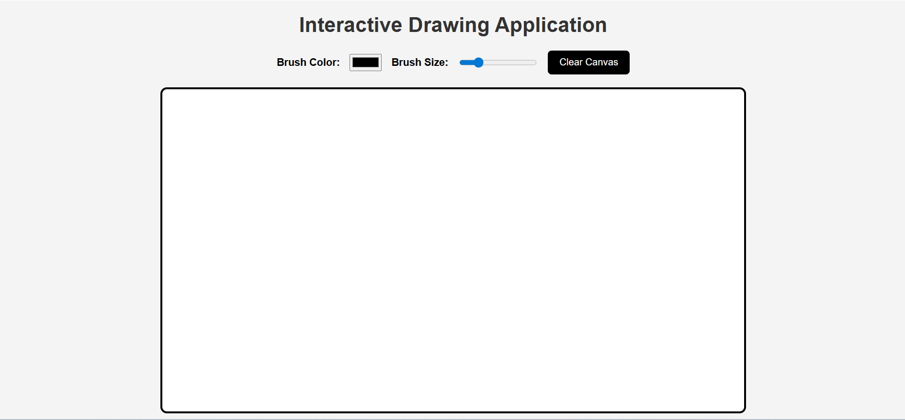

# Interactive Drawing Application

HTML5 Canvas task to create an interactive drawing application that allows users to draw, change brush colors and clear the screen using JavaScript mouse events.

---

# Features

- Draw on canvas using mouse
- Change brush color
- Change brush size
- Clear screen button
- Interactive HTML5 Canvas

---

# Technologies Used

- HTML5
- CSS3
- JavaScript

---

# Project Files

- index.html
- style.css
- script.js
- README.md

---

# Screenshots

## Empty Canvas

---

## Drawing Example

---

# Author

Iqra
